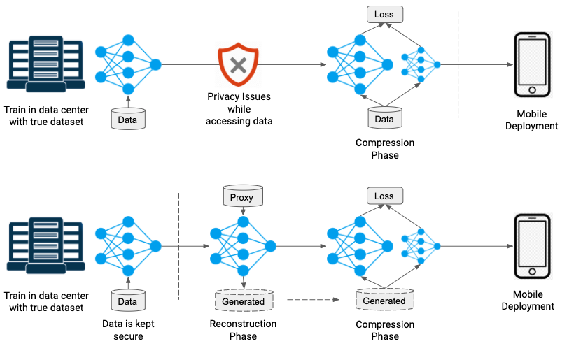
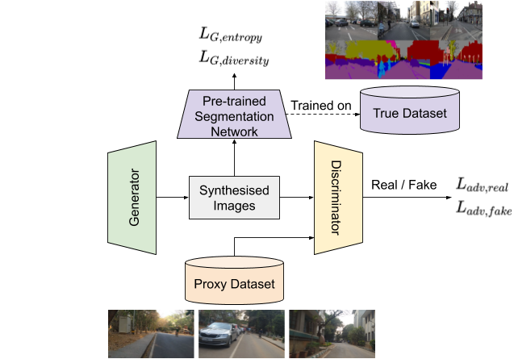

# Data-free Knowledge Distillation for Segmentation using Data-Enriching GAN

This repository is the official implementation of [Data-free Knowledge Distillation for Segmentation using Data-Enriching GAN
](https://arxiv.org/abs/2011.00809). 

### Deployment pipelines



*(Top row)* A deployment pipeline where a large model is initially
trained on some dataset. Later for mobile deployment when the model needs to be compressed, the
dataset needs to be accessed again causing privacy concerns. 

*(Bottom row)* We present a deployment
pipeline where no access to data is required. Instead we use a proxy dataset to generate representative
samples to perform model compression.

### Data-Enriching GAN architecture



## Requirements

To install requirements:

```setup
pip install pytorch-lightning==0.7.0
pip install tensorboard
```

>📋  Describe how to set up the environment, e.g. pip/conda/docker commands, download datasets, etc...

## TODO: Training and evaluation

To train the model(s) in the paper, run this command:

```train
python train.py --input-data <path_to_data> --alpha 10 --beta 20
```

## TODO: Results

Our model achieves the following performance on :

### [Image Classification on ImageNet](https://paperswithcode.com/sota/image-classification-on-imagenet)

| Model name         | Top 1 Accuracy  | Top 5 Accuracy |
| ------------------ |---------------- | -------------- |
| My awesome model   |     85%         |      95%       |

>📋  Include a table of results from your paper, and link back to the leaderboard for clarity and context. If your main result is a figure, include that figure and link to the command or notebook to reproduce it. 


## Contributing

>📋  Pick a licence and describe how to contribute to your code repository. 
